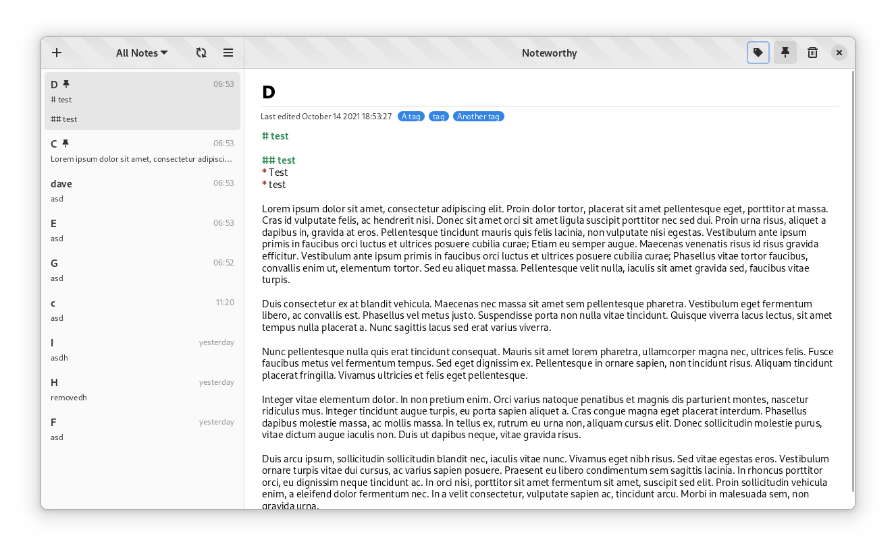
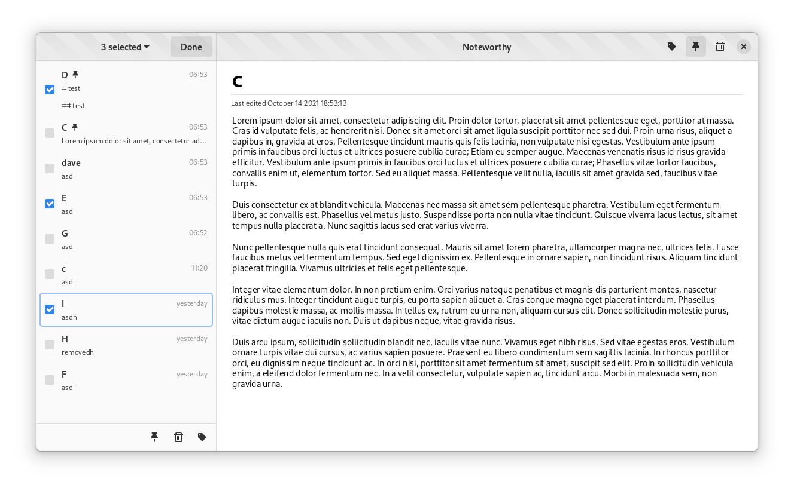
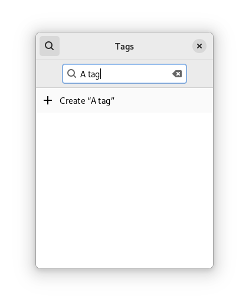

# Noteworthy

## What's already working?
* Trash, pinning
* Note creation and deletion
* Note metadata
* Powerful tag system
* Filtering
* Basic markdown
* Batch notes selection and editing
* Syncing

## What's not working yet?
* Setup page
* Git integration
* Attachments
* WYSIWG Editing
* Homepage (Includes reminders, recents, mini notepads etc.)

## Some screenshot (Design may vary in the future)

  

  

  

